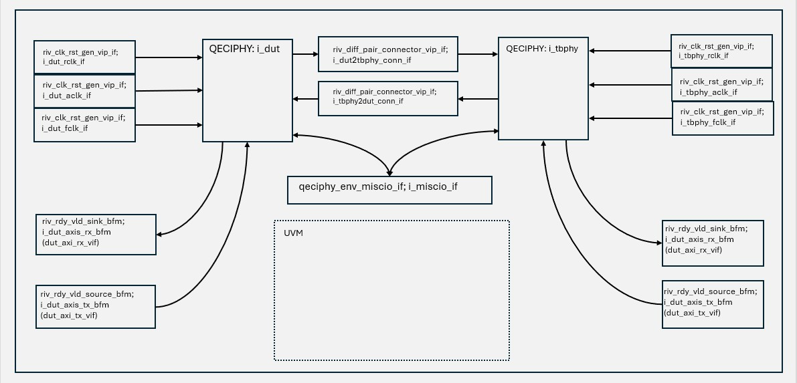

# QECIPHY UVM top level tb structure
The block diagram below shows the structure of the top-level of the UVM TB.
|  |
|:--:|
| *Block Diagram of QECIPHY UVM TB* |

# Description of Agents

## QECIPHY instances
The i_dut instance is the QECIPHY being tested in the TB. The i_tbphy instance is another QECIPHY which is needed to process/drive the DUT signals (it is effectively acting as a simulation model).
   
## Clock/Reset Interfaces
There is one riv_clk_rst_gen_vip_if instance per clock on each instance of the QECIPHY (DUT and TB Phy).These interfaces drive the ACLK, RCLK and FCLK clocks as well as the single ARST_n (which comes from the i_dut_aclk_if and i_tbphy_aclk_if generators respectively The generators (which are just SV interfaces with methods to configure them) are accessed from environment sequences via the sequencer's config object (e.g. p_sequencer.m_config.m_vifs.dut_aclk_vif).They can also be accessed from scoreboards and coverage_collectors via the m_config.m_vifs field.

## P-Bus BFMs (containing Interfaces)
There is one P-Bus agent for each QECIPHY instance (i_dut and i_tbphy).These agents allow driving and monitoring of the P-Bus signals and attached to the m_dut_pbus_agt and m_tbphy_pbus_agt agents in the environment.

## Rdy/Vld Sink BFMs (containing Interfaces)
There is one Rdy/Vld Sink agent for each QECIPHY instance (i_dut and i_tbphy).These agents allow monitoring of the AXI-Stream Rx channel signals.They are attached to the m_dut_axis_rx_agt and m_tbphy_axis_rx_agt agents in the environment.In this TB, the RDY signals of these interfaces are constantly driven to 1 by the agents (as per QECi-Phy spec).

## Rdy/Vld Source BFMs (containing Interfaces)
There is one Rdy/Vld Source agent for each QECIPHY instance (i_dut and i_tbphy).These agents allow driving and monitoring of the AXI-Stream Tx channel signals.They are attached to the m_dut_axis_tx_agt and m_tbphy_axis_tx_agt agents in the environment.

## Differential Pair Interfaces
There are 2 riv_diff_pair_connector_vip_if connecting the i_dut and i_tbphy QECIPHY instances (one per direction, identified by instance name).These interfaces act, by default, as simple differntial-pair wires but can be driven via methods defined in them to disconnect, force, swap or short the two wires they model.The interfaces and methods are accessed from environment sequences via the sequencer's config object (e.g. p_sequencer.m_config.m_vifs.dut2tbphy_conn_vif).They can also be accessed from scoreboards and coverage_collectors via the m_config.m_vifs field.

## MISC I/O Interface
The qeciphy_env_miscio_if interface provides connections to the clocks and resets of each QECIPHY instance as well as their ECODE and STATUS outputs.The interface is accessed from environment sequences via the sequencer's config object (e.g. p_sequencer.m_config.m_vifs.miscio_vif).It can also be accessed from scoreboards and coverage_collectors via the m_config.m_vifs field.

# Run time arguments used in UVM Tests
Below is the description of the optional run time arguments used in the tests.  

| OPT_ARGS | Description |
|----------|-------------|
| +DUT_XFERS | Specify number of words to be sent to DUT Tx AXI-S Port (n = decimal integer > 0)|
| +MIN_DUT_DELAY_CLKS=n| Specify min. delay between words to be sent over to the DUT Tx AXI-S Port (n = decimal integer >= 0) |
| +MAX_DUT_DELAY_CLKS=n | Specify max. delay between words to be sent over to the DUT Tx AXI-S Port (n = decimal integer <= min. delay)|
| +TBPHY_XFERS=n  | Specify number of words to be sent to TB-Phy Tx AXI-S Port (n = decimal integer > 0) |
| +MIN_TBPHY_DELAY_CLKS=n | Specify min. delay between words to be sent over to the TB-Phy Tx AXI-S Port (n = decimal integer >= 0) |
| +MAX_TBPHY_DELAY_CLKS=n  |  Specify max. delay between words to be sent over to the TB-Phy Tx AXI-S Port (n = decimal integer <= min. delay)|
| +DUT_CYCLES=n | Number of DUT-iniitated cycles to do (default -1 = leave it random).|
| +TBPHY_CYCLES=n | Number of TB-Phy-iniitated cycles to do (default -1 = leave it random).|
| +MIN_GAP_NS=n | Minimum time (in ns) from link up before each power cycle (default 0us).|
| +MAX_GAP_NS=n | Maximum time (in ns) from link up before each power cycle (default 200us).|
| +MIN_DURATION_NS=n | Minimum time (in ns) before powered-down device powers back up (default 30us).|
| +MAX_DURATION_NS=n | Maximum time (in ns) before powered-down device powers back up (default 60us).|
| +MIN_AXIS_DELAY_CLKS=n | Minimum number of clocks between AXI-S xfers (default 0). |
| +MAX_AXIS_DELAY_CLKS=n | Maximum number of clocks between AXI-S xfers (default 5).|
| +NUM_ERRORS=n |  Number of errors to generate in the test run (default = 5 errors).|
| +MIN_DELAY_PS=n | Minimum time (in ps) from link becoming ready to error occurring (default = 0ps).|
| +MAX_DELAY_PS=n | Maximum time (in ps) from link becoming ready to error occurring (default = 10us).|
| +ERROR_WIDTH_PS=n | Duration (in ps) that error condition will persist (default = 120ps).|
| +MIN_STUTTER_CLKS=n | Minimum time (number of clks) between "stuttery" AXI-S data transfers (default = 1 clk)|
| +MAX_STUTTER_CLKS=n | Maximum time (number of clks) between "stuttery" AXI-S data transfers (default = 40 clks).|

# UVM Testbench simulation using Synopsys tools
## Supported simulators

| Simulator | Version |
|-----------|---------|
| **Synopsys VCS** | U-2023.03+ | 

To run the UVM testbench there are 2 steps to be followed:
1. Generate simulation files for the required transceiver (GTY, or GTH, or GTX). This is done using the following command  
*   `make generate-xci OPT_PROFILE=<opt_profile> OPT_SIM_FILES=true`  
*   OPT_PROFILE must be chosen from the profiles avaliable in `config.json` 
Note* - Make sure Vivado is loaded in the environment. This is needed to generate the simulation files. 
      
2.  Run any test on the UVM testbench using VCS and optionally Verdi(gui) using the following commands 
* `make uvm-sim OPT_TEST=<test_name> OPT_PROFILE=<profile> OPT_MODE=gui (optional)`  
* The test logs are saved as <test_name>.log

# UVM Regression

To run regressions for uvm tests  
* Run `bash uvm/regression_run.sh`
* All test results are saved in uvm_regression_logs/<test_name>_<seed>_<profile>.log

Note* - Always use `make distclean` before generating files for a different transceiver.  
